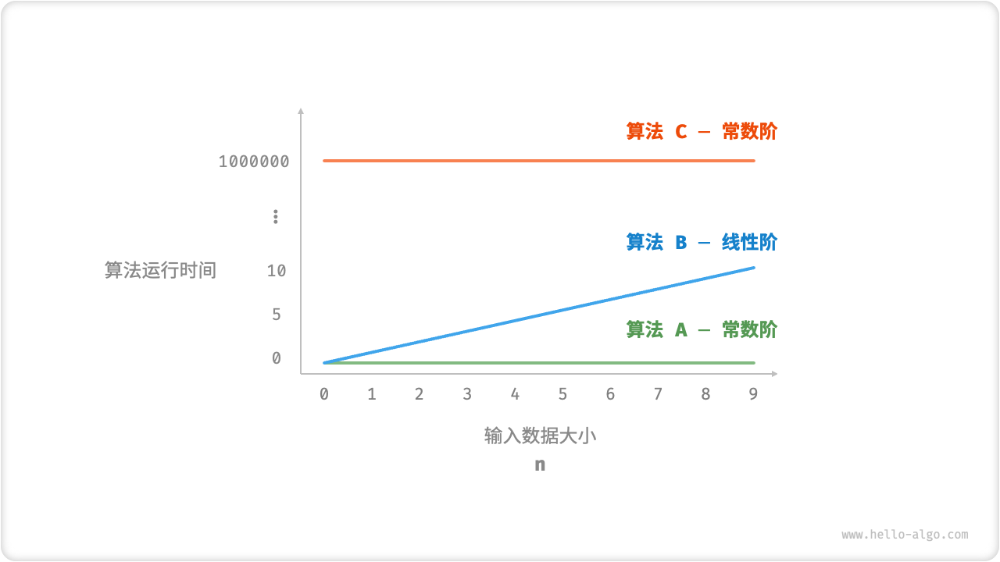
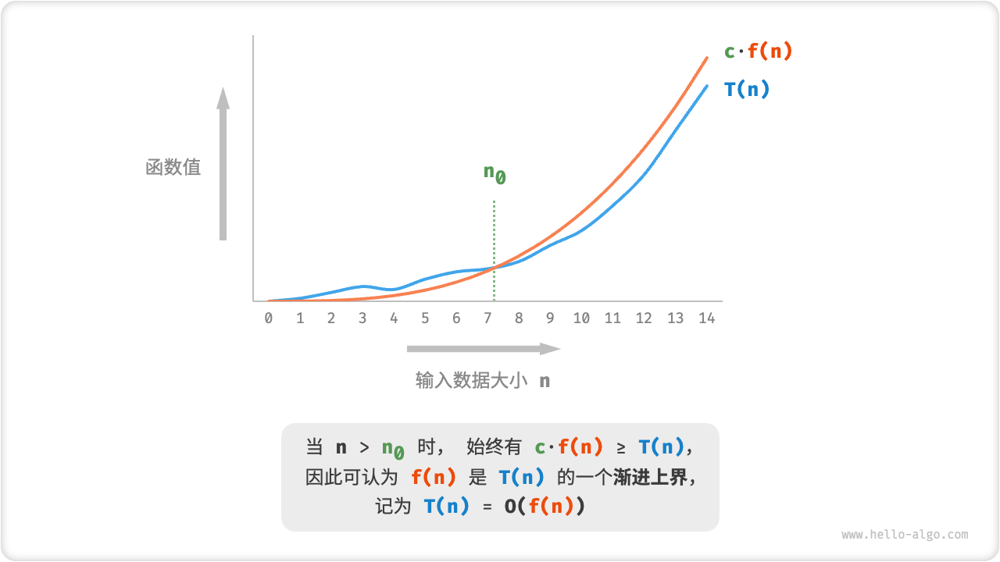
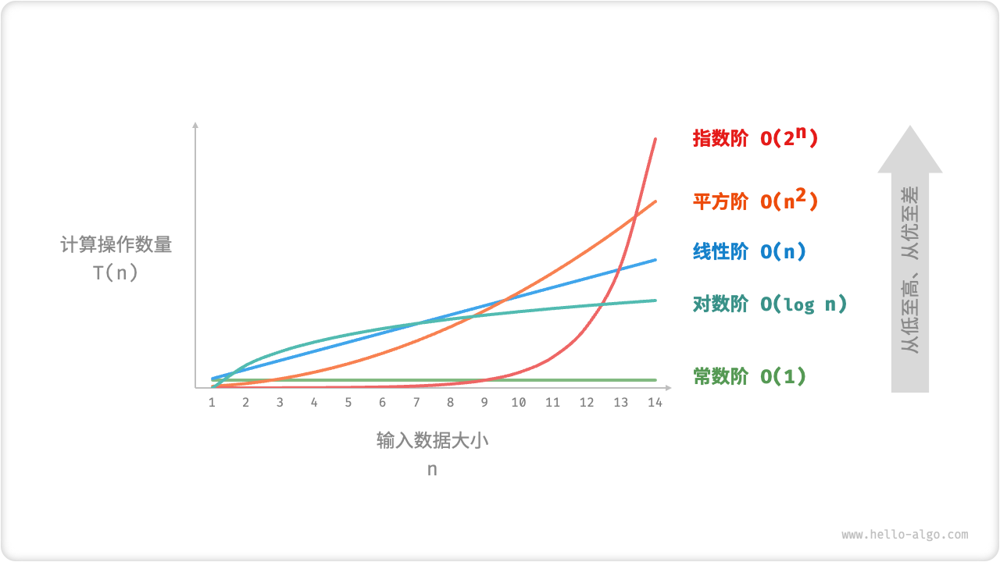
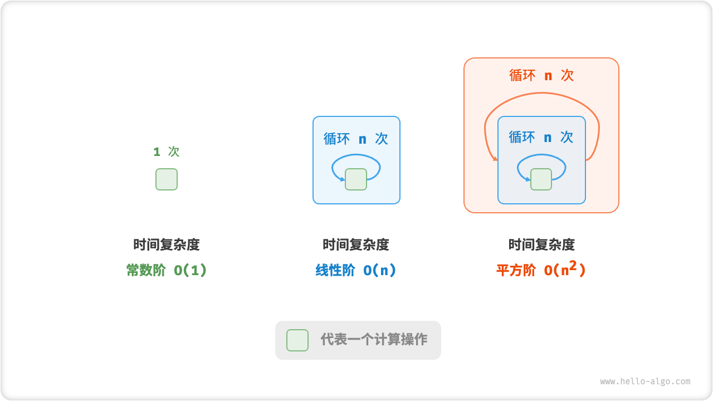
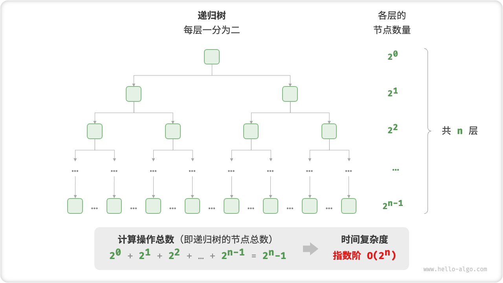
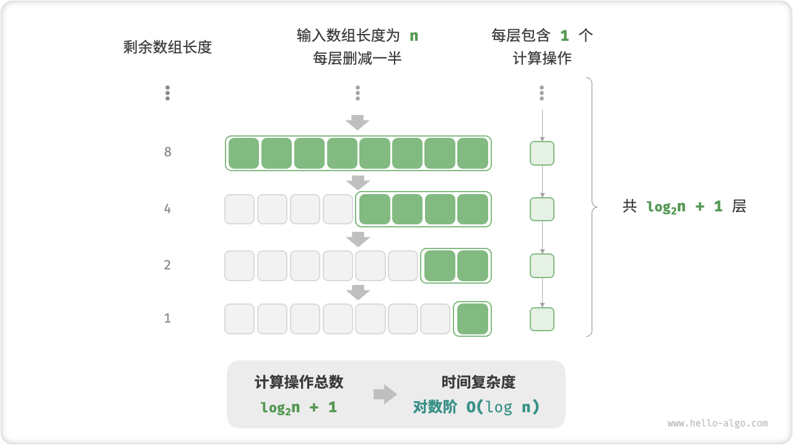
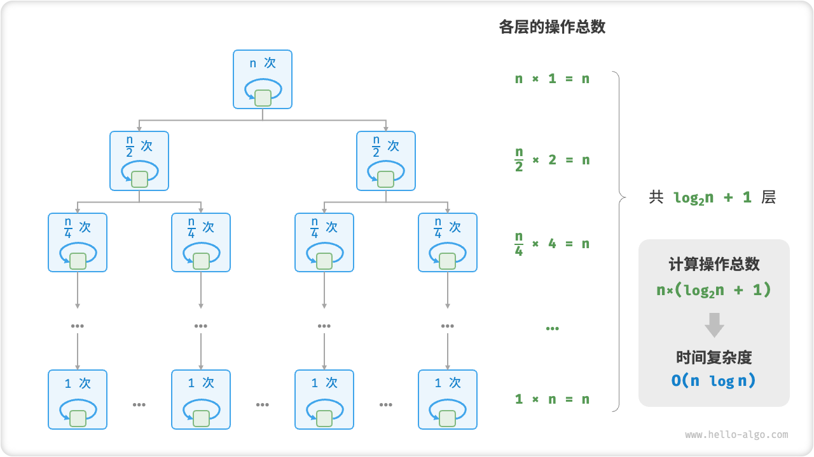
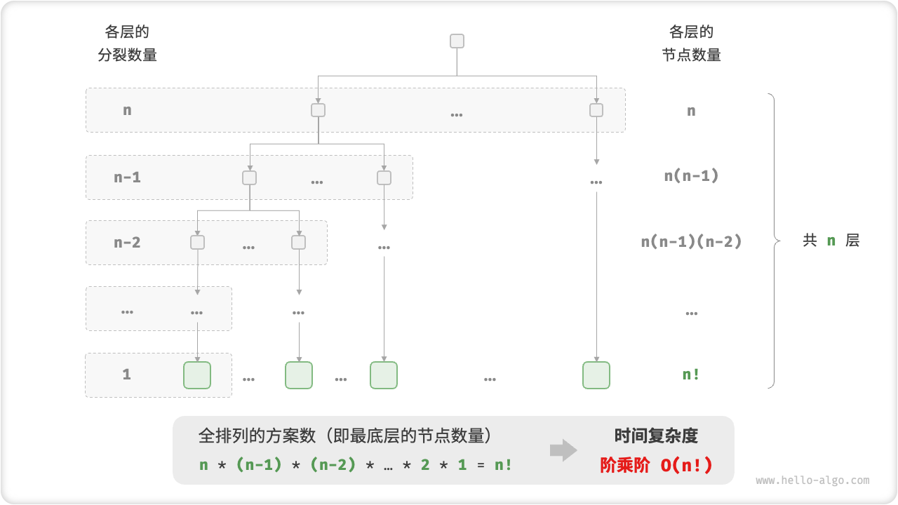

# 时间复杂度

运行时间可以直观且准确地反映算法的效率。如果我们想要准确预估一段代码的运行时间，应该如何操作呢？

1. **确定运行平台**，包括硬件配置、编程语言、系统环境等，这些因素都会影响代码的运行效率。
2. **评估各种计算操作所需的运行时间**，例如加法操作 `+` 需要 1 ns ，乘法操作 `*` 需要 10 ns ，打印操作 `print()` 需要 5 ns 等。
3. **统计代码中所有的计算操作**，并将所有操作的执行时间求和，从而得到运行时间。

例如在以下代码中，输入数据大小为 $n$ ：

=== "Python"

    ```python title=""
    # 在某运行平台下
    def algorithm(n: int):
        a = 2      # 1 ns
        a = a + 1  # 1 ns
        a = a * 2  # 10 ns
        # 循环 n 次
        for _ in range(n):  # 1 ns
            print(0)        # 5 ns
    ```

=== "C++"

    ```cpp title=""
    // 在某运行平台下
    void algorithm(int n) {
        int a = 2;  // 1 ns
        a = a + 1;  // 1 ns
        a = a * 2;  // 10 ns
        // 循环 n 次
        for (int i = 0; i < n; i++) {  // 1 ns ，每轮都要执行 i++
            cout << 0 << endl;         // 5 ns
        }
    }
    ```

=== "Java"

    ```java title=""
    // 在某运行平台下
    void algorithm(int n) {
        int a = 2;  // 1 ns
        a = a + 1;  // 1 ns
        a = a * 2;  // 10 ns
        // 循环 n 次
        for (int i = 0; i < n; i++) {  // 1 ns ，每轮都要执行 i++
            System.out.println(0);     // 5 ns
        }
    }
    ```

=== "C#"

    ```csharp title=""
    // 在某运行平台下
    void algorithm(int n) {
        int a = 2;  // 1 ns
        a = a + 1;  // 1 ns
        a = a * 2;  // 10 ns
        // 循环 n 次
        for (int i = 0; i < n; i++) {  // 1 ns ，每轮都要执行 i++
            Console.WriteLine(0);      // 5 ns
        }
    }
    ```

=== "Go"

    ```go title=""
    // 在某运行平台下
    func algorithm(n int) {
        a := 2     // 1 ns
        a = a + 1  // 1 ns
        a = a * 2  // 10 ns
        // 循环 n 次
        for i := 0; i < n; i++ {  // 1 ns
            fmt.Println(a)        // 5 ns
        }
    }
    ```

=== "Swift"

    ```swift title=""
    // 在某运行平台下
    func algorithm(n: Int) {
        var a = 2 // 1 ns
        a = a + 1 // 1 ns
        a = a * 2 // 10 ns
        // 循环 n 次
        for _ in 0 ..< n { // 1 ns
            print(0) // 5 ns
        }
    }
    ```

=== "JS"

    ```javascript title=""
    // 在某运行平台下
    function algorithm(n) {
        var a = 2; // 1 ns
        a = a + 1; // 1 ns
        a = a * 2; // 10 ns
        // 循环 n 次
        for(let i = 0; i < n; i++) { // 1 ns ，每轮都要执行 i++
            console.log(0); // 5 ns
        }
    }
    ```

=== "TS"

    ```typescript title=""
    // 在某运行平台下
    function algorithm(n: number): void {
        var a: number = 2; // 1 ns
        a = a + 1; // 1 ns
        a = a * 2; // 10 ns
        // 循环 n 次
        for(let i = 0; i < n; i++) { // 1 ns ，每轮都要执行 i++
            console.log(0); // 5 ns
        }
    }
    ```

=== "Dart"

    ```dart title=""
    // 在某运行平台下
    void algorithm(int n) {
      int a = 2; // 1 ns
      a = a + 1; // 1 ns
      a = a * 2; // 10 ns
      // 循环 n 次
      for (int i = 0; i < n; i++) { // 1 ns ，每轮都要执行 i++
        print(0); // 5 ns
      }
    }
    ```

=== "Rust"

    ```rust title=""
    // 在某运行平台下
    fn algorithm(n: i32) {
        let mut a = 2;      // 1 ns
        a = a + 1;          // 1 ns
        a = a * 2;          // 10 ns
        // 循环 n 次
        for _ in 0..n {     // 1 ns ，每轮都要执行 i++
            println!("{}", 0);  // 5 ns
        }
    }
    ```

=== "C"

    ```c title=""
    // 在某运行平台下
    void algorithm(int n) {
        int a = 2;  // 1 ns
        a = a + 1;  // 1 ns
        a = a * 2;  // 10 ns
        // 循环 n 次
        for (int i = 0; i < n; i++) {   // 1 ns ，每轮都要执行 i++
            printf("%d", 0);            // 5 ns
        }
    }
    ```

=== "Zig"

    ```zig title=""

    ```

根据以上方法，可以得到算法运行时间为 $6n + 12$ ns ：

$$
1 + 1 + 10 + (1 + 5) \times n = 6n + 12
$$

但实际上，**统计算法的运行时间既不合理也不现实**。首先，我们不希望将预估时间和运行平台绑定，因为算法需要在各种不同的平台上运行。其次，我们很难获知每种操作的运行时间，这给预估过程带来了极大的难度。

## 统计时间增长趋势

时间复杂度分析统计的不是算法运行时间，**而是算法运行时间随着数据量变大时的增长趋势**。

“时间增长趋势”这个概念比较抽象，我们通过一个例子来加以理解。假设输入数据大小为 $n$ ，给定三个算法函数 `A`、`B` 和 `C` ：

=== "Python"

    ```python title=""
    # 算法 A 的时间复杂度：常数阶
    def algorithm_A(n: int):
        print(0)
    # 算法 B 的时间复杂度：线性阶
    def algorithm_B(n: int):
        for _ in range(n):
            print(0)
    # 算法 C 的时间复杂度：常数阶
    def algorithm_C(n: int):
        for _ in range(1000000):
            print(0)
    ```

=== "C++"

    ```cpp title=""
    // 算法 A 的时间复杂度：常数阶
    void algorithm_A(int n) {
        cout << 0 << endl;
    }
    // 算法 B 的时间复杂度：线性阶
    void algorithm_B(int n) {
        for (int i = 0; i < n; i++) {
            cout << 0 << endl;
        }
    }
    // 算法 C 的时间复杂度：常数阶
    void algorithm_C(int n) {
        for (int i = 0; i < 1000000; i++) {
            cout << 0 << endl;
        }
    }
    ```

=== "Java"

    ```java title=""
    // 算法 A 的时间复杂度：常数阶
    void algorithm_A(int n) {
        System.out.println(0);
    }
    // 算法 B 的时间复杂度：线性阶
    void algorithm_B(int n) {
        for (int i = 0; i < n; i++) {
            System.out.println(0);
        }
    }
    // 算法 C 的时间复杂度：常数阶
    void algorithm_C(int n) {
        for (int i = 0; i < 1000000; i++) {
            System.out.println(0);
        }
    }
    ```

=== "C#"

    ```csharp title=""
    // 算法 A 的时间复杂度：常数阶
    void algorithm_A(int n) {
        Console.WriteLine(0);
    }
    // 算法 B 的时间复杂度：线性阶
    void algorithm_B(int n) {
        for (int i = 0; i < n; i++) {
            Console.WriteLine(0);
        }
    }
    // 算法 C 的时间复杂度：常数阶
    void algorithm_C(int n) {
        for (int i = 0; i < 1000000; i++) {
            Console.WriteLine(0);
        }
    }
    ```

=== "Go"

    ```go title=""
    // 算法 A 的时间复杂度：常数阶
    func algorithm_A(n int) {
        fmt.Println(0)
    }
    // 算法 B 的时间复杂度：线性阶
    func algorithm_B(n int) {
        for i := 0; i < n; i++ {
            fmt.Println(0)
        }
    }
    // 算法 C 的时间复杂度：常数阶
    func algorithm_C(n int) {
        for i := 0; i < 1000000; i++ {
            fmt.Println(0)
        }
    }
    ```

=== "Swift"

    ```swift title=""
    // 算法 A 的时间复杂度：常数阶
    func algorithmA(n: Int) {
        print(0)
    }

    // 算法 B 的时间复杂度：线性阶
    func algorithmB(n: Int) {
        for _ in 0 ..< n {
            print(0)
        }
    }

    // 算法 C 的时间复杂度：常数阶
    func algorithmC(n: Int) {
        for _ in 0 ..< 1000000 {
            print(0)
        }
    }
    ```

=== "JS"

    ```javascript title=""
    // 算法 A 的时间复杂度：常数阶
    function algorithm_A(n) {
        console.log(0);
    }
    // 算法 B 的时间复杂度：线性阶
    function algorithm_B(n) {
        for (let i = 0; i < n; i++) {
            console.log(0);
        }
    }
    // 算法 C 的时间复杂度：常数阶
    function algorithm_C(n) {
        for (let i = 0; i < 1000000; i++) {
            console.log(0);
        }
    }

    ```

=== "TS"

    ```typescript title=""
    // 算法 A 的时间复杂度：常数阶
    function algorithm_A(n: number): void {
        console.log(0);
    }
    // 算法 B 的时间复杂度：线性阶
    function algorithm_B(n: number): void {
        for (let i = 0; i < n; i++) {
            console.log(0);
        }
    }
    // 算法 C 的时间复杂度：常数阶
    function algorithm_C(n: number): void {
        for (let i = 0; i < 1000000; i++) {
            console.log(0);
        }
    }
    ```

=== "Dart"

    ```dart title=""
    // 算法 A 的时间复杂度：常数阶
    void algorithmA(int n) {
      print(0);
    }
    // 算法 B 的时间复杂度：线性阶
    void algorithmB(int n) {
      for (int i = 0; i < n; i++) {
        print(0);
      }
    }
    // 算法 C 的时间复杂度：常数阶
    void algorithmC(int n) {
      for (int i = 0; i < 1000000; i++) {
        print(0);
      }
    }
    ```

=== "Rust"

    ```rust title=""
    // 算法 A 的时间复杂度：常数阶
    fn algorithm_A(n: i32) {
        println!("{}", 0);
    }
    // 算法 B 的时间复杂度：线性阶
    fn algorithm_B(n: i32) {
        for _ in 0..n {
            println!("{}", 0);
        }
    }
    // 算法 C 的时间复杂度：常数阶
    fn algorithm_C(n: i32) {
        for _ in 0..1000000 {
            println!("{}", 0);
        }
    }
    ```

=== "C"

    ```c title=""
    // 算法 A 的时间复杂度：常数阶
    void algorithm_A(int n) {
        printf("%d", 0);
    }
    // 算法 B 的时间复杂度：线性阶
    void algorithm_B(int n) {
        for (int i = 0; i < n; i++) {
            printf("%d", 0);
        }
    }
    // 算法 C 的时间复杂度：常数阶
    void algorithm_C(int n) {
        for (int i = 0; i < 1000000; i++) {
            printf("%d", 0);
        }
    }
    ```

=== "Zig"

    ```zig title=""

    ```

下图展示了以上三个算法函数的时间复杂度。

- 算法 `A` 只有 $1$ 个打印操作，算法运行时间不随着 $n$ 增大而增长。我们称此算法的时间复杂度为“常数阶”。
- 算法 `B` 中的打印操作需要循环 $n$ 次，算法运行时间随着 $n$ 增大呈线性增长。此算法的时间复杂度被称为“线性阶”。
- 算法 `C` 中的打印操作需要循环 $1000000$ 次，虽然运行时间很长，但它与输入数据大小 $n$ 无关。因此 `C` 的时间复杂度和 `A` 相同，仍为“常数阶”。



相较于直接统计算法运行时间，时间复杂度分析有哪些特点呢？

- **时间复杂度能够有效评估算法效率**。例如，算法 `B` 的运行时间呈线性增长，在 $n > 1$ 时比算法 `A` 更慢，在 $n > 1000000$ 时比算法 `C` 更慢。事实上，只要输入数据大小 $n$ 足够大，复杂度为“常数阶”的算法一定优于“线性阶”的算法，这正是时间增长趋势所表达的含义。
- **时间复杂度的推算方法更简便**。显然，运行平台和计算操作类型都与算法运行时间的增长趋势无关。因此在时间复杂度分析中，我们可以简单地将所有计算操作的执行时间视为相同的“单位时间”，从而将“计算操作的运行时间的统计”简化为“计算操作的数量的统计”，这样以来估算难度就大大降低了。
- **时间复杂度也存在一定的局限性**。例如，尽管算法 `A` 和 `C` 的时间复杂度相同，但实际运行时间差别很大。同样，尽管算法 `B` 的时间复杂度比 `C` 高，但在输入数据大小 $n$ 较小时，算法 `B` 明显优于算法 `C` 。在这些情况下，我们很难仅凭时间复杂度判断算法效率的高低。当然，尽管存在上述问题，复杂度分析仍然是评判算法效率最有效且常用的方法。

## 函数渐近上界

给定一个输入大小为 $n$ 的函数：

=== "Python"

    ```python title=""
    def algorithm(n: int):
        a = 1      # +1
        a = a + 1  # +1
        a = a * 2  # +1
        # 循环 n 次
        for i in range(n):  # +1
            print(0)        # +1
    ```

=== "C++"

    ```cpp title=""
    void algorithm(int n) {
        int a = 1;  // +1
        a = a + 1;  // +1
        a = a * 2;  // +1
        // 循环 n 次
        for (int i = 0; i < n; i++) { // +1（每轮都执行 i ++）
            cout << 0 << endl;    // +1
        }
    }
    ```

=== "Java"

    ```java title=""
    void algorithm(int n) {
        int a = 1;  // +1
        a = a + 1;  // +1
        a = a * 2;  // +1
        // 循环 n 次
        for (int i = 0; i < n; i++) { // +1（每轮都执行 i ++）
            System.out.println(0);    // +1
        }
    }
    ```

=== "C#"

    ```csharp title=""
    void algorithm(int n) {
        int a = 1;  // +1
        a = a + 1;  // +1
        a = a * 2;  // +1
        // 循环 n 次
        for (int i = 0; i < n; i++) {   // +1（每轮都执行 i ++）
            Console.WriteLine(0);   // +1
        }
    }
    ```

=== "Go"

    ```go title=""
    func algorithm(n int) {
        a := 1      // +1
        a = a + 1   // +1
        a = a * 2   // +1
        // 循环 n 次
        for i := 0; i < n; i++ {   // +1
            fmt.Println(a)         // +1
        }
    }
    ```

=== "Swift"

    ```swift title=""
    func algorithm(n: Int) {
        var a = 1 // +1
        a = a + 1 // +1
        a = a * 2 // +1
        // 循环 n 次
        for _ in 0 ..< n { // +1
            print(0) // +1
        }
    }
    ```

=== "JS"

    ```javascript title=""
    function algorithm(n) {
        var a = 1; // +1
        a += 1; // +1
        a *= 2; // +1
        // 循环 n 次
        for(let i = 0; i < n; i++){ // +1（每轮都执行 i ++）
            console.log(0); // +1
        }
    }
    ```

=== "TS"

    ```typescript title=""
    function algorithm(n: number): void{
        var a: number = 1; // +1
        a += 1; // +1
        a *= 2; // +1
        // 循环 n 次
        for(let i = 0; i < n; i++){ // +1（每轮都执行 i ++）
            console.log(0); // +1
        }
    }
    ```

=== "Dart"

    ```dart title=""
    void algorithm(int n) {
      int a = 1; // +1
      a = a + 1; // +1
      a = a * 2; // +1
      // 循环 n 次
      for (int i = 0; i < n; i++) { // +1（每轮都执行 i ++）
        print(0); // +1
      }
    }
    ```

=== "Rust"

    ```rust title=""
    fn algorithm(n: i32) {
        let mut a = 1;   // +1
        a = a + 1;      // +1
        a = a * 2;      // +1

        // 循环 n 次
        for _ in 0..n { // +1（每轮都执行 i ++）
            println!("{}", 0); // +1
        }
    }
    ```

=== "C"

    ```c title=""
    void algorithm(int n) {
        int a = 1;  // +1
        a = a + 1;  // +1
        a = a * 2;  // +1
        // 循环 n 次
        for (int i = 0; i < n; i++) {   // +1（每轮都执行 i ++）
            printf("%d", 0);            // +1
        }
    }  
    ```

=== "Zig"

    ```zig title=""

    ```

设算法的操作数量是一个关于输入数据大小 $n$ 的函数，记为 $T(n)$ ，则以上函数的的操作数量为：

$$
T(n) = 3 + 2n
$$

$T(n)$ 是一次函数，说明其运行时间的增长趋势是线性的，因此它的时间复杂度是线性阶。

我们将线性阶的时间复杂度记为 $O(n)$ ，这个数学符号称为「大 $O$ 记号 big-$O$ notation」，表示函数 $T(n)$ 的「渐近上界 asymptotic upper bound」。

时间复杂度分析本质上是计算“操作数量函数 $T(n)$”的渐近上界，其具有明确的数学定义。

!!! abstract "函数渐近上界"

    若存在正实数 $c$ 和实数 $n_0$ ，使得对于所有的 $n > n_0$ ，均有 $T(n) \leq c \cdot f(n)$ ，则可认为 $f(n)$ 给出了 $T(n)$ 的一个渐近上界，记为 $T(n) = O(f(n))$ 。

如下图所示，计算渐近上界就是寻找一个函数 $f(n)$ ，使得当 $n$ 趋向于无穷大时，$T(n)$ 和 $f(n)$ 处于相同的增长级别，仅相差一个常数项 $c$ 的倍数。



## 推算方法

渐近上界的数学味儿有点重，如果你感觉没有完全理解，也无须担心。因为在实际使用中，我们只需要掌握推算方法，数学意义就可以逐渐领悟。

根据定义，确定 $f(n)$ 之后，我们便可得到时间复杂度 $O(f(n))$ 。那么如何确定渐近上界 $f(n)$ 呢？总体分为两步：首先统计操作数量，然后判断渐近上界。

### 第一步：统计操作数量

针对代码，逐行从上到下计算即可。然而，由于上述 $c \cdot f(n)$ 中的常数项 $c$ 可以取任意大小，**因此操作数量 $T(n)$ 中的各种系数、常数项都可以被忽略**。根据此原则，可以总结出以下计数简化技巧。

1. **忽略 $T(n)$ 中的常数项**。因为它们都与 $n$ 无关，所以对时间复杂度不产生影响。
2. **省略所有系数**。例如，循环 $2n$ 次、$5n + 1$ 次等，都可以简化记为 $n$ 次，因为 $n$ 前面的系数对时间复杂度没有影响。
3. **循环嵌套时使用乘法**。总操作数量等于外层循环和内层循环操作数量之积，每一层循环依然可以分别套用第 `1.` 点和第 `2.` 点的技巧。

给定一个函数，我们可以用上述技巧来统计操作数量。

=== "Python"

    ```python title=""
    def algorithm(n: int):
        a = 1      # +0（技巧 1）
        a = a + n  # +0（技巧 1）
        # +n（技巧 2）
        for i in range(5 * n + 1):
            print(0)
        # +n*n（技巧 3）
        for i in range(2 * n):
            for j in range(n + 1):
                print(0)
    ```

=== "C++"

    ```cpp title=""
    void algorithm(int n) {
        int a = 1;  // +0（技巧 1）
        a = a + n;  // +0（技巧 1）
        // +n（技巧 2）
        for (int i = 0; i < 5 * n + 1; i++) {
            cout << 0 << endl;
        }
        // +n*n（技巧 3）
        for (int i = 0; i < 2 * n; i++) {
            for (int j = 0; j < n + 1; j++) {
                cout << 0 << endl;
            }
        }
    }
    ```

=== "Java"

    ```java title=""
    void algorithm(int n) {
        int a = 1;  // +0（技巧 1）
        a = a + n;  // +0（技巧 1）
        // +n（技巧 2）
        for (int i = 0; i < 5 * n + 1; i++) {
            System.out.println(0);
        }
        // +n*n（技巧 3）
        for (int i = 0; i < 2 * n; i++) {
            for (int j = 0; j < n + 1; j++) {
                System.out.println(0);
            }
        }
    }
    ```

=== "C#"

    ```csharp title=""
    void algorithm(int n) {
        int a = 1;  // +0（技巧 1）
        a = a + n;  // +0（技巧 1）
        // +n（技巧 2）
        for (int i = 0; i < 5 * n + 1; i++) {
            Console.WriteLine(0);
        }
        // +n*n（技巧 3）
        for (int i = 0; i < 2 * n; i++) {
            for (int j = 0; j < n + 1; j++) {
                Console.WriteLine(0);
            }
        }
    }
    ```

=== "Go"

    ```go title=""
    func algorithm(n int) {
        a := 1     // +0（技巧 1）
        a = a + n  // +0（技巧 1）
        // +n（技巧 2）
        for i := 0; i < 5 * n + 1; i++ {
            fmt.Println(0)
        }
        // +n*n（技巧 3）
        for i := 0; i < 2 * n; i++ {
            for j := 0; j < n + 1; j++ {
                fmt.Println(0)
            }
        }
    }
    ```

=== "Swift"

    ```swift title=""
    func algorithm(n: Int) {
        var a = 1 // +0（技巧 1）
        a = a + n // +0（技巧 1）
        // +n（技巧 2）
        for _ in 0 ..< (5 * n + 1) {
            print(0)
        }
        // +n*n（技巧 3）
        for _ in 0 ..< (2 * n) {
            for _ in 0 ..< (n + 1) {
                print(0)
            }
        }
    }
    ```

=== "JS"

    ```javascript title=""
    function algorithm(n) {
        let a = 1;  // +0（技巧 1）
        a = a + n;  // +0（技巧 1）
        // +n（技巧 2）
        for (let i = 0; i < 5 * n + 1; i++) {
            console.log(0);
        }
        // +n*n（技巧 3）
        for (let i = 0; i < 2 * n; i++) {
            for (let j = 0; j < n + 1; j++) {
                console.log(0);
            }
        }
    }
    ```

=== "TS"

    ```typescript title=""
    function algorithm(n: number): void {
        let a = 1;  // +0（技巧 1）
        a = a + n;  // +0（技巧 1）
        // +n（技巧 2）
        for (let i = 0; i < 5 * n + 1; i++) {
            console.log(0);
        }
        // +n*n（技巧 3）
        for (let i = 0; i < 2 * n; i++) {
            for (let j = 0; j < n + 1; j++) {
                console.log(0);
            }
        }
    }
    ```

=== "Dart"

    ```dart title=""
    void algorithm(int n) {
      int a = 1; // +0（技巧 1）
      a = a + n; // +0（技巧 1）
      // +n（技巧 2）
      for (int i = 0; i < 5 * n + 1; i++) {
        print(0);
      }
      // +n*n（技巧 3）
      for (int i = 0; i < 2 * n; i++) {
        for (int j = 0; j < n + 1; j++) {
          print(0);
        }
      }
    }
    ```

=== "Rust"

    ```rust title=""
    fn algorithm(n: i32) {
        let mut a = 1;     // +0（技巧 1）
        a = a + n;        // +0（技巧 1）

        // +n（技巧 2）
        for i in 0..(5 * n + 1) {
            println!("{}", 0);
        }

        // +n*n（技巧 3）
        for i in 0..(2 * n) {
            for j in 0..(n + 1) {
                println!("{}", 0);
            }
        }
    }
    ```

=== "C"

    ```c title=""
    void algorithm(int n) {
        int a = 1;  // +0（技巧 1）
        a = a + n;  // +0（技巧 1）
        // +n（技巧 2）
        for (int i = 0; i < 5 * n + 1; i++) {
            printf("%d", 0);
        }
        // +n*n（技巧 3）
        for (int i = 0; i < 2 * n; i++) {
            for (int j = 0; j < n + 1; j++) {
                printf("%d", 0);
            }
        }
    }
    ```

=== "Zig"

    ```zig title=""

    ```

以下公式展示了使用上述技巧前后的统计结果，两者推出的时间复杂度都为 $O(n^2)$ 。

$$
\begin{aligned}
T(n) & = 2n(n + 1) + (5n + 1) + 2 & \text{完整统计 (-.-|||)} \newline
& = 2n^2 + 7n + 3 \newline
T(n) & = n^2 + n & \text{偷懒统计 (o.O)}
\end{aligned}
$$

### 第二步：判断渐近上界

**时间复杂度由多项式 $T(n)$ 中最高阶的项来决定**。这是因为在 $n$ 趋于无穷大时，最高阶的项将发挥主导作用，其他项的影响都可以被忽略。

下表展示了一些例子，其中一些夸张的值是为了强调“系数无法撼动阶数”这一结论。当 $n$ 趋于无穷大时，这些常数变得无足轻重。

<p align="center"> 表 <id> &nbsp; 不同操作数量对应的时间复杂度 </p>

| 操作数量 $T(n)$        | 时间复杂度 $O(f(n))$ |
| ---------------------- | -------------------- |
| $100000$               | $O(1)$               |
| $3n + 2$               | $O(n)$               |
| $2n^2 + 3n + 2$        | $O(n^2)$             |
| $n^3 + 10000n^2$       | $O(n^3)$             |
| $2^n + 10000n^{10000}$ | $O(2^n)$             |

## 常见类型

设输入数据大小为 $n$ ，常见的时间复杂度类型如下图所示（按照从低到高的顺序排列）。

$$
\begin{aligned}
O(1) < O(\log n) < O(n) < O(n \log n) < O(n^2) < O(2^n) < O(n!) \newline
\text{常数阶} < \text{对数阶} < \text{线性阶} < \text{线性对数阶} < \text{平方阶} < \text{指数阶} < \text{阶乘阶}
\end{aligned}
$$



### 常数阶 $O(1)$

常数阶的操作数量与输入数据大小 $n$ 无关，即不随着 $n$ 的变化而变化。

在以下函数中，尽管操作数量 `size` 可能很大，但由于其与输入数据大小 $n$ 无关，因此时间复杂度仍为 $O(1)$ ：

=== "Python"

    ```python title="time_complexity.py"
    [class]{}-[func]{constant}
    ```

=== "C++"

    ```cpp title="time_complexity.cpp"
    [class]{}-[func]{constant}
    ```

=== "Java"

    ```java title="time_complexity.java"
    [class]{time_complexity}-[func]{constant}
    ```

=== "C#"

    ```csharp title="time_complexity.cs"
    [class]{time_complexity}-[func]{constant}
    ```

=== "Go"

    ```go title="time_complexity.go"
    [class]{}-[func]{constant}
    ```

=== "Swift"

    ```swift title="time_complexity.swift"
    [class]{}-[func]{constant}
    ```

=== "JS"

    ```javascript title="time_complexity.js"
    [class]{}-[func]{constant}
    ```

=== "TS"

    ```typescript title="time_complexity.ts"
    [class]{}-[func]{constant}
    ```

=== "Dart"

    ```dart title="time_complexity.dart"
    [class]{}-[func]{constant}
    ```

=== "Rust"

    ```rust title="time_complexity.rs"
    [class]{}-[func]{constant}
    ```

=== "C"

    ```c title="time_complexity.c"
    [class]{}-[func]{constant}
    ```

=== "Zig"

    ```zig title="time_complexity.zig"
    [class]{}-[func]{constant}
    ```

### 线性阶 $O(n)$

线性阶的操作数量相对于输入数据大小 $n$ 以线性级别增长。线性阶通常出现在单层循环中：

=== "Python"

    ```python title="time_complexity.py"
    [class]{}-[func]{linear}
    ```

=== "C++"

    ```cpp title="time_complexity.cpp"
    [class]{}-[func]{linear}
    ```

=== "Java"

    ```java title="time_complexity.java"
    [class]{time_complexity}-[func]{linear}
    ```

=== "C#"

    ```csharp title="time_complexity.cs"
    [class]{time_complexity}-[func]{linear}
    ```

=== "Go"

    ```go title="time_complexity.go"
    [class]{}-[func]{linear}
    ```

=== "Swift"

    ```swift title="time_complexity.swift"
    [class]{}-[func]{linear}
    ```

=== "JS"

    ```javascript title="time_complexity.js"
    [class]{}-[func]{linear}
    ```

=== "TS"

    ```typescript title="time_complexity.ts"
    [class]{}-[func]{linear}
    ```

=== "Dart"

    ```dart title="time_complexity.dart"
    [class]{}-[func]{linear}
    ```

=== "Rust"

    ```rust title="time_complexity.rs"
    [class]{}-[func]{linear}
    ```

=== "C"

    ```c title="time_complexity.c"
    [class]{}-[func]{linear}
    ```

=== "Zig"

    ```zig title="time_complexity.zig"
    [class]{}-[func]{linear}
    ```

遍历数组和遍历链表等操作的时间复杂度均为 $O(n)$ ，其中 $n$ 为数组或链表的长度：

=== "Python"

    ```python title="time_complexity.py"
    [class]{}-[func]{array_traversal}
    ```

=== "C++"

    ```cpp title="time_complexity.cpp"
    [class]{}-[func]{arrayTraversal}
    ```

=== "Java"

    ```java title="time_complexity.java"
    [class]{time_complexity}-[func]{arrayTraversal}
    ```

=== "C#"

    ```csharp title="time_complexity.cs"
    [class]{time_complexity}-[func]{arrayTraversal}
    ```

=== "Go"

    ```go title="time_complexity.go"
    [class]{}-[func]{arrayTraversal}
    ```

=== "Swift"

    ```swift title="time_complexity.swift"
    [class]{}-[func]{arrayTraversal}
    ```

=== "JS"

    ```javascript title="time_complexity.js"
    [class]{}-[func]{arrayTraversal}
    ```

=== "TS"

    ```typescript title="time_complexity.ts"
    [class]{}-[func]{arrayTraversal}
    ```

=== "Dart"

    ```dart title="time_complexity.dart"
    [class]{}-[func]{arrayTraversal}
    ```

=== "Rust"

    ```rust title="time_complexity.rs"
    [class]{}-[func]{array_traversal}
    ```

=== "C"

    ```c title="time_complexity.c"
    [class]{}-[func]{arrayTraversal}
    ```

=== "Zig"

    ```zig title="time_complexity.zig"
    [class]{}-[func]{arrayTraversal}
    ```

值得注意的是，**输入数据大小 $n$ 需根据输入数据的类型来具体确定**。比如在第一个示例中，变量 $n$ 为输入数据大小；在第二个示例中，数组长度 $n$ 为数据大小。

### 平方阶 $O(n^2)$

平方阶的操作数量相对于输入数据大小 $n$ 以平方级别增长。平方阶通常出现在嵌套循环中，外层循环和内层循环都为 $O(n)$ ，因此总体为 $O(n^2)$ ：

=== "Python"

    ```python title="time_complexity.py"
    [class]{}-[func]{quadratic}
    ```

=== "C++"

    ```cpp title="time_complexity.cpp"
    [class]{}-[func]{quadratic}
    ```

=== "Java"

    ```java title="time_complexity.java"
    [class]{time_complexity}-[func]{quadratic}
    ```

=== "C#"

    ```csharp title="time_complexity.cs"
    [class]{time_complexity}-[func]{quadratic}
    ```

=== "Go"

    ```go title="time_complexity.go"
    [class]{}-[func]{quadratic}
    ```

=== "Swift"

    ```swift title="time_complexity.swift"
    [class]{}-[func]{quadratic}
    ```

=== "JS"

    ```javascript title="time_complexity.js"
    [class]{}-[func]{quadratic}
    ```

=== "TS"

    ```typescript title="time_complexity.ts"
    [class]{}-[func]{quadratic}
    ```

=== "Dart"

    ```dart title="time_complexity.dart"
    [class]{}-[func]{quadratic}
    ```

=== "Rust"

    ```rust title="time_complexity.rs"
    [class]{}-[func]{quadratic}
    ```

=== "C"

    ```c title="time_complexity.c"
    [class]{}-[func]{quadratic}
    ```

=== "Zig"

    ```zig title="time_complexity.zig"
    [class]{}-[func]{quadratic}
    ```

下图对比了常数阶、线性阶和平方阶三种时间复杂度。



以冒泡排序为例，外层循环执行 $n - 1$ 次，内层循环执行 $n-1$、$n-2$、$\dots$、$2$、$1$ 次，平均为 $n / 2$ 次，因此时间复杂度为 $O((n - 1) n / 2) = O(n^2)$ 。

=== "Python"

    ```python title="time_complexity.py"
    [class]{}-[func]{bubble_sort}
    ```

=== "C++"

    ```cpp title="time_complexity.cpp"
    [class]{}-[func]{bubbleSort}
    ```

=== "Java"

    ```java title="time_complexity.java"
    [class]{time_complexity}-[func]{bubbleSort}
    ```

=== "C#"

    ```csharp title="time_complexity.cs"
    [class]{time_complexity}-[func]{bubbleSort}
    ```

=== "Go"

    ```go title="time_complexity.go"
    [class]{}-[func]{bubbleSort}
    ```

=== "Swift"

    ```swift title="time_complexity.swift"
    [class]{}-[func]{bubbleSort}
    ```

=== "JS"

    ```javascript title="time_complexity.js"
    [class]{}-[func]{bubbleSort}
    ```

=== "TS"

    ```typescript title="time_complexity.ts"
    [class]{}-[func]{bubbleSort}
    ```

=== "Dart"

    ```dart title="time_complexity.dart"
    [class]{}-[func]{bubbleSort}
    ```

=== "Rust"

    ```rust title="time_complexity.rs"
    [class]{}-[func]{bubble_sort}
    ```

=== "C"

    ```c title="time_complexity.c"
    [class]{}-[func]{bubbleSort}
    ```

=== "Zig"

    ```zig title="time_complexity.zig"
    [class]{}-[func]{bubbleSort}
    ```

### 指数阶 $O(2^n)$

生物学的“细胞分裂”是指数阶增长的典型例子：初始状态为 $1$ 个细胞，分裂一轮后变为 $2$ 个，分裂两轮后变为 $4$ 个，以此类推，分裂 $n$ 轮后有 $2^n$ 个细胞。

下图和以下代码模拟了细胞分裂的过程，时间复杂度为 $O(2^n)$ 。

=== "Python"

    ```python title="time_complexity.py"
    [class]{}-[func]{exponential}
    ```

=== "C++"

    ```cpp title="time_complexity.cpp"
    [class]{}-[func]{exponential}
    ```

=== "Java"

    ```java title="time_complexity.java"
    [class]{time_complexity}-[func]{exponential}
    ```

=== "C#"

    ```csharp title="time_complexity.cs"
    [class]{time_complexity}-[func]{exponential}
    ```

=== "Go"

    ```go title="time_complexity.go"
    [class]{}-[func]{exponential}
    ```

=== "Swift"

    ```swift title="time_complexity.swift"
    [class]{}-[func]{exponential}
    ```

=== "JS"

    ```javascript title="time_complexity.js"
    [class]{}-[func]{exponential}
    ```

=== "TS"

    ```typescript title="time_complexity.ts"
    [class]{}-[func]{exponential}
    ```

=== "Dart"

    ```dart title="time_complexity.dart"
    [class]{}-[func]{exponential}
    ```

=== "Rust"

    ```rust title="time_complexity.rs"
    [class]{}-[func]{exponential}
    ```

=== "C"

    ```c title="time_complexity.c"
    [class]{}-[func]{exponential}
    ```

=== "Zig"

    ```zig title="time_complexity.zig"
    [class]{}-[func]{exponential}
    ```



在实际算法中，指数阶常出现于递归函数中。例如在以下代码中，其递归地一分为二，经过 $n$ 次分裂后停止：

=== "Python"

    ```python title="time_complexity.py"
    [class]{}-[func]{exp_recur}
    ```

=== "C++"

    ```cpp title="time_complexity.cpp"
    [class]{}-[func]{expRecur}
    ```

=== "Java"

    ```java title="time_complexity.java"
    [class]{time_complexity}-[func]{expRecur}
    ```

=== "C#"

    ```csharp title="time_complexity.cs"
    [class]{time_complexity}-[func]{expRecur}
    ```

=== "Go"

    ```go title="time_complexity.go"
    [class]{}-[func]{expRecur}
    ```

=== "Swift"

    ```swift title="time_complexity.swift"
    [class]{}-[func]{expRecur}
    ```

=== "JS"

    ```javascript title="time_complexity.js"
    [class]{}-[func]{expRecur}
    ```

=== "TS"

    ```typescript title="time_complexity.ts"
    [class]{}-[func]{expRecur}
    ```

=== "Dart"

    ```dart title="time_complexity.dart"
    [class]{}-[func]{expRecur}
    ```

=== "Rust"

    ```rust title="time_complexity.rs"
    [class]{}-[func]{exp_recur}
    ```

=== "C"

    ```c title="time_complexity.c"
    [class]{}-[func]{expRecur}
    ```

=== "Zig"

    ```zig title="time_complexity.zig"
    [class]{}-[func]{expRecur}
    ```

指数阶增长非常迅速，在穷举法（暴力搜索、回溯等）中比较常见。对于数据规模较大的问题，指数阶是不可接受的，通常需要使用动态规划或贪心等算法来解决。

### 对数阶 $O(\log n)$

与指数阶相反，对数阶反映了“每轮缩减到一半”的情况。设输入数据大小为 $n$ ，由于每轮缩减到一半，因此循环次数是 $\log_2 n$ ，即 $2^n$ 的反函数。

下图和以下代码模拟了“每轮缩减到一半”的过程，时间复杂度为 $O(\log_2 n)$ ，简记为 $O(\log n)$ 。

=== "Python"

    ```python title="time_complexity.py"
    [class]{}-[func]{logarithmic}
    ```

=== "C++"

    ```cpp title="time_complexity.cpp"
    [class]{}-[func]{logarithmic}
    ```

=== "Java"

    ```java title="time_complexity.java"
    [class]{time_complexity}-[func]{logarithmic}
    ```

=== "C#"

    ```csharp title="time_complexity.cs"
    [class]{time_complexity}-[func]{logarithmic}
    ```

=== "Go"

    ```go title="time_complexity.go"
    [class]{}-[func]{logarithmic}
    ```

=== "Swift"

    ```swift title="time_complexity.swift"
    [class]{}-[func]{logarithmic}
    ```

=== "JS"

    ```javascript title="time_complexity.js"
    [class]{}-[func]{logarithmic}
    ```

=== "TS"

    ```typescript title="time_complexity.ts"
    [class]{}-[func]{logarithmic}
    ```

=== "Dart"

    ```dart title="time_complexity.dart"
    [class]{}-[func]{logarithmic}
    ```

=== "Rust"

    ```rust title="time_complexity.rs"
    [class]{}-[func]{logarithmic}
    ```

=== "C"

    ```c title="time_complexity.c"
    [class]{}-[func]{logarithmic}
    ```

=== "Zig"

    ```zig title="time_complexity.zig"
    [class]{}-[func]{logarithmic}
    ```



与指数阶类似，对数阶也常出现于递归函数中。以下代码形成了一个高度为 $\log_2 n$ 的递归树：

=== "Python"

    ```python title="time_complexity.py"
    [class]{}-[func]{log_recur}
    ```

=== "C++"

    ```cpp title="time_complexity.cpp"
    [class]{}-[func]{logRecur}
    ```

=== "Java"

    ```java title="time_complexity.java"
    [class]{time_complexity}-[func]{logRecur}
    ```

=== "C#"

    ```csharp title="time_complexity.cs"
    [class]{time_complexity}-[func]{logRecur}
    ```

=== "Go"

    ```go title="time_complexity.go"
    [class]{}-[func]{logRecur}
    ```

=== "Swift"

    ```swift title="time_complexity.swift"
    [class]{}-[func]{logRecur}
    ```

=== "JS"

    ```javascript title="time_complexity.js"
    [class]{}-[func]{logRecur}
    ```

=== "TS"

    ```typescript title="time_complexity.ts"
    [class]{}-[func]{logRecur}
    ```

=== "Dart"

    ```dart title="time_complexity.dart"
    [class]{}-[func]{logRecur}
    ```

=== "Rust"

    ```rust title="time_complexity.rs"
    [class]{}-[func]{log_recur}
    ```

=== "C"

    ```c title="time_complexity.c"
    [class]{}-[func]{logRecur}
    ```

=== "Zig"

    ```zig title="time_complexity.zig"
    [class]{}-[func]{logRecur}
    ```

对数阶常出现于基于分治策略的算法中，体现了“一分为多”和“化繁为简”的算法思想。它增长缓慢，是仅次于常数阶的理想的时间复杂度。

!!! tip "$O(\log n)$ 的底数是多少？"

    准确来说，“一分为 $m$”对应的时间复杂度是 $O(\log_m n)$ 。而通过对数换底公式，我们可以得到具有不同底数的、相等的时间复杂度：

    $$
    O(\log_m n) = O(\log_k n / \log_k m) = O(\log_k n)
    $$

    也就是说，底数 $m$ 可以在不影响复杂度的前提下转换。因此我们通常会省略底数 $m$ ，将对数阶直接记为 $O(\log n)$ 。

### 线性对数阶 $O(n \log n)$

线性对数阶常出现于嵌套循环中，两层循环的时间复杂度分别为 $O(\log n)$ 和 $O(n)$ 。相关代码如下：

=== "Python"

    ```python title="time_complexity.py"
    [class]{}-[func]{linear_log_recur}
    ```

=== "C++"

    ```cpp title="time_complexity.cpp"
    [class]{}-[func]{linearLogRecur}
    ```

=== "Java"

    ```java title="time_complexity.java"
    [class]{time_complexity}-[func]{linearLogRecur}
    ```

=== "C#"

    ```csharp title="time_complexity.cs"
    [class]{time_complexity}-[func]{linearLogRecur}
    ```

=== "Go"

    ```go title="time_complexity.go"
    [class]{}-[func]{linearLogRecur}
    ```

=== "Swift"

    ```swift title="time_complexity.swift"
    [class]{}-[func]{linearLogRecur}
    ```

=== "JS"

    ```javascript title="time_complexity.js"
    [class]{}-[func]{linearLogRecur}
    ```

=== "TS"

    ```typescript title="time_complexity.ts"
    [class]{}-[func]{linearLogRecur}
    ```

=== "Dart"

    ```dart title="time_complexity.dart"
    [class]{}-[func]{linearLogRecur}
    ```

=== "Rust"

    ```rust title="time_complexity.rs"
    [class]{}-[func]{linear_log_recur}
    ```

=== "C"

    ```c title="time_complexity.c"
    [class]{}-[func]{linearLogRecur}
    ```

=== "Zig"

    ```zig title="time_complexity.zig"
    [class]{}-[func]{linearLogRecur}
    ```

下图展示了线性对数阶的生成方式。二叉树的每一层的操作总数都为 $n$ ，树共有 $\log_2 n + 1$ 层，因此时间复杂度为 $O(n \log n)$ 。



主流排序算法的时间复杂度通常为 $O(n \log n)$ ，例如快速排序、归并排序、堆排序等。

### 阶乘阶 $O(n!)$

阶乘阶对应数学上的“全排列”问题。给定 $n$ 个互不重复的元素，求其所有可能的排列方案，方案数量为：

$$
n! = n \times (n - 1) \times (n - 2) \times \dots \times 2 \times 1
$$

阶乘通常使用递归实现。如下图和以下代码所示，第一层分裂出 $n$ 个，第二层分裂出 $n - 1$ 个，以此类推，直至第 $n$ 层时停止分裂：

=== "Python"

    ```python title="time_complexity.py"
    [class]{}-[func]{factorial_recur}
    ```

=== "C++"

    ```cpp title="time_complexity.cpp"
    [class]{}-[func]{factorialRecur}
    ```

=== "Java"

    ```java title="time_complexity.java"
    [class]{time_complexity}-[func]{factorialRecur}
    ```

=== "C#"

    ```csharp title="time_complexity.cs"
    [class]{time_complexity}-[func]{factorialRecur}
    ```

=== "Go"

    ```go title="time_complexity.go"
    [class]{}-[func]{factorialRecur}
    ```

=== "Swift"

    ```swift title="time_complexity.swift"
    [class]{}-[func]{factorialRecur}
    ```

=== "JS"

    ```javascript title="time_complexity.js"
    [class]{}-[func]{factorialRecur}
    ```

=== "TS"

    ```typescript title="time_complexity.ts"
    [class]{}-[func]{factorialRecur}
    ```

=== "Dart"

    ```dart title="time_complexity.dart"
    [class]{}-[func]{factorialRecur}
    ```

=== "Rust"

    ```rust title="time_complexity.rs"
    [class]{}-[func]{factorial_recur}
    ```

=== "C"

    ```c title="time_complexity.c"
    [class]{}-[func]{factorialRecur}
    ```

=== "Zig"

    ```zig title="time_complexity.zig"
    [class]{}-[func]{factorialRecur}
    ```



请注意，因为当 $n \geq 4$ 时恒有 $n! > 2^n$ ，所以阶乘阶比指数阶增长得更快，在 $n$ 较大时也是不可接受的。

## 最差、最佳、平均时间复杂度

**算法的时间效率往往不是固定的，而是与输入数据的分布有关**。假设输入一个长度为 $n$ 的数组 `nums` ，其中 `nums` 由从 $1$ 至 $n$ 的数字组成，每个数字只出现一次；但元素顺序是随机打乱的，任务目标是返回元素 $1$ 的索引。我们可以得出以下结论。

- 当 `nums = [?, ?, ..., 1]` ，即当末尾元素是 $1$ 时，需要完整遍历数组，**达到最差时间复杂度 $O(n)$** 。
- 当 `nums = [1, ?, ?, ...]` ，即当首个元素为 $1$ 时，无论数组多长都不需要继续遍历，**达到最佳时间复杂度 $\Omega(1)$** 。

“最差时间复杂度”对应函数渐近上界，使用大 $O$ 记号表示。相应地，“最佳时间复杂度”对应函数渐近下界，用 $\Omega$ 记号表示：

=== "Python"

    ```python title="worst_best_time_complexity.py"
    [class]{}-[func]{random_numbers}

    [class]{}-[func]{find_one}
    ```

=== "C++"

    ```cpp title="worst_best_time_complexity.cpp"
    [class]{}-[func]{randomNumbers}

    [class]{}-[func]{findOne}
    ```

=== "Java"

    ```java title="worst_best_time_complexity.java"
    [class]{worst_best_time_complexity}-[func]{randomNumbers}

    [class]{worst_best_time_complexity}-[func]{findOne}
    ```

=== "C#"

    ```csharp title="worst_best_time_complexity.cs"
    [class]{worst_best_time_complexity}-[func]{randomNumbers}

    [class]{worst_best_time_complexity}-[func]{findOne}
    ```

=== "Go"

    ```go title="worst_best_time_complexity.go"
    [class]{}-[func]{randomNumbers}

    [class]{}-[func]{findOne}
    ```

=== "Swift"

    ```swift title="worst_best_time_complexity.swift"
    [class]{}-[func]{randomNumbers}

    [class]{}-[func]{findOne}
    ```

=== "JS"

    ```javascript title="worst_best_time_complexity.js"
    [class]{}-[func]{randomNumbers}

    [class]{}-[func]{findOne}
    ```

=== "TS"

    ```typescript title="worst_best_time_complexity.ts"
    [class]{}-[func]{randomNumbers}

    [class]{}-[func]{findOne}
    ```

=== "Dart"

    ```dart title="worst_best_time_complexity.dart"
    [class]{}-[func]{randomNumbers}

    [class]{}-[func]{findOne}
    ```

=== "Rust"

    ```rust title="worst_best_time_complexity.rs"
    [class]{}-[func]{random_numbers}

    [class]{}-[func]{find_one}
    ```

=== "C"

    ```c title="worst_best_time_complexity.c"
    [class]{}-[func]{randomNumbers}

    [class]{}-[func]{findOne}
    ```

=== "Zig"

    ```zig title="worst_best_time_complexity.zig"
    // 生成一个数组，元素为 { 1, 2, ..., n }，顺序被打乱
    pub fn randomNumbers(comptime n: usize) [n]i32 {
        var nums: [n]i32 = undefined;
        // 生成数组 nums = { 1, 2, 3, ..., n }
        for (nums) |*num, i| {
            num.* = @intCast(i32, i) + 1;
        }
        // 随机打乱数组元素
        const rand = std.crypto.random;
        rand.shuffle(i32, &nums);
        return nums;
    }

    // 查找数组 nums 中数字 1 所在索引
    pub fn findOne(nums: []i32) i32 {
        for (nums) |num, i| {
            // 当元素 1 在数组头部时，达到最佳时间复杂度 O(1)
            // 当元素 1 在数组尾部时，达到最差时间复杂度 O(n)
            if (num == 1) return @intCast(i32, i);
        }
        return -1;
    }
    ```

值得说明的是，我们在实际中很少使用最佳时间复杂度，因为通常只有在很小概率下才能达到，可能会带来一定的误导性。**而最差时间复杂度更为实用，因为它给出了一个效率安全值**，让我们可以放心地使用算法。

从上述示例可以看出，最差或最佳时间复杂度只出现于“特殊的数据分布”，这些情况的出现概率可能很小，并不能真实地反映算法运行效率。相比之下，**平均时间复杂度可以体现算法在随机输入数据下的运行效率**，用 $\Theta$ 记号来表示。

对于部分算法，我们可以简单地推算出随机数据分布下的平均情况。比如上述示例，由于输入数组是被打乱的，因此元素 $1$ 出现在任意索引的概率都是相等的，那么算法的平均循环次数就是数组长度的一半 $n / 2$ ，平均时间复杂度为 $\Theta(n / 2) = \Theta(n)$ 。

但对于较为复杂的算法，计算平均时间复杂度往往是比较困难的，因为很难分析出在数据分布下的整体数学期望。在这种情况下，我们通常使用最差时间复杂度作为算法效率的评判标准。

!!! question "为什么很少看到 $\Theta$ 符号？"

    可能由于 $O$ 符号过于朗朗上口，我们常常使用它来表示平均时间复杂度。但从严格意义上看，这种做法并不规范。在本书和其他资料中，若遇到类似“平均时间复杂度 $O(n)$”的表述，请将其直接理解为 $\Theta(n)$ 。
