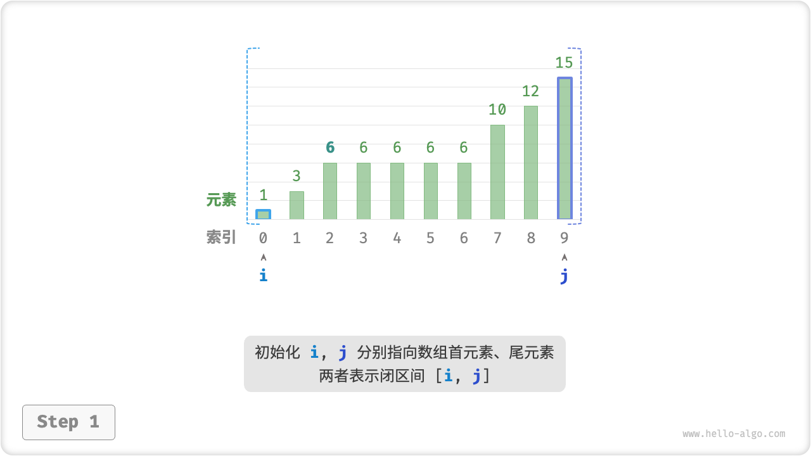
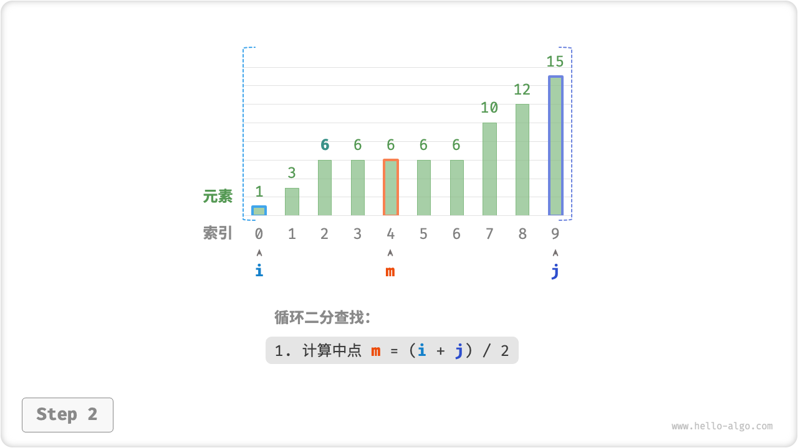
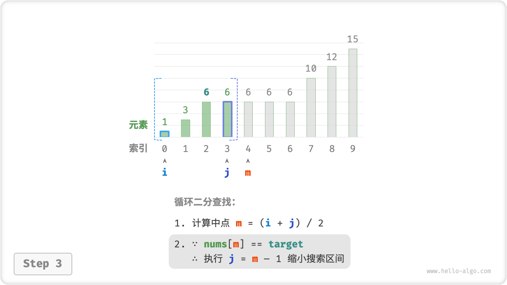
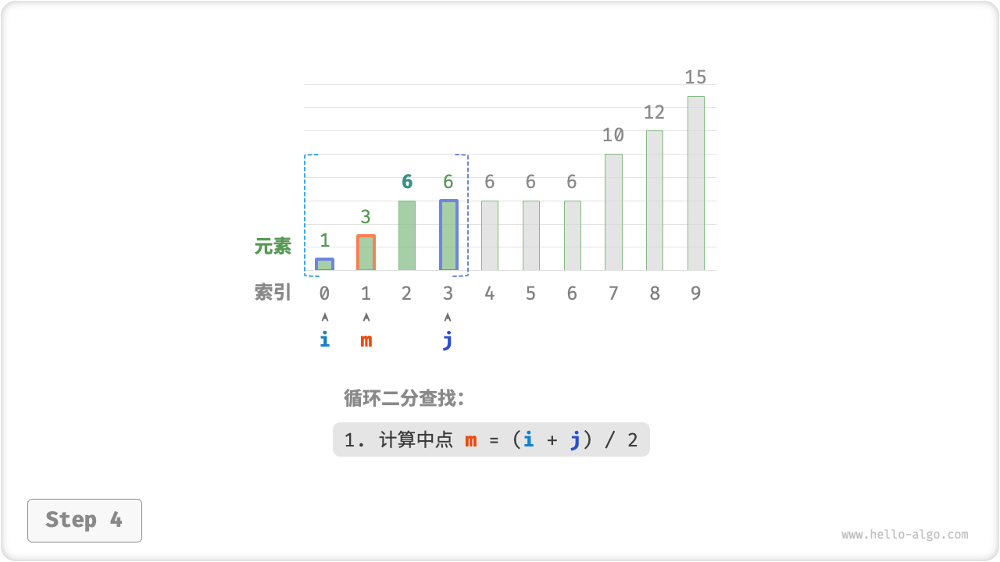
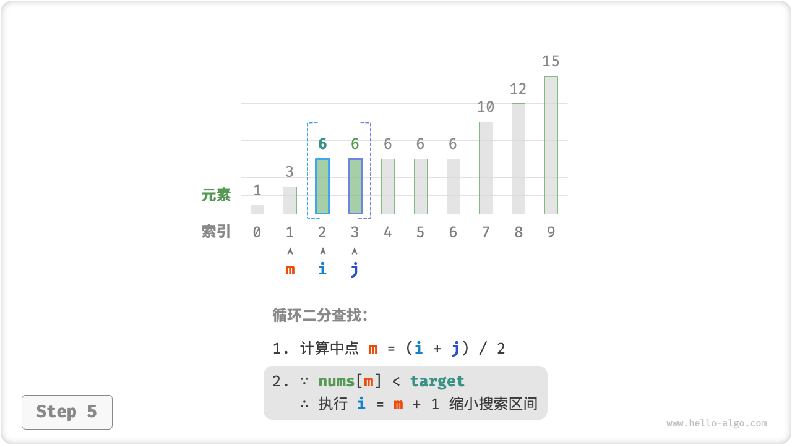
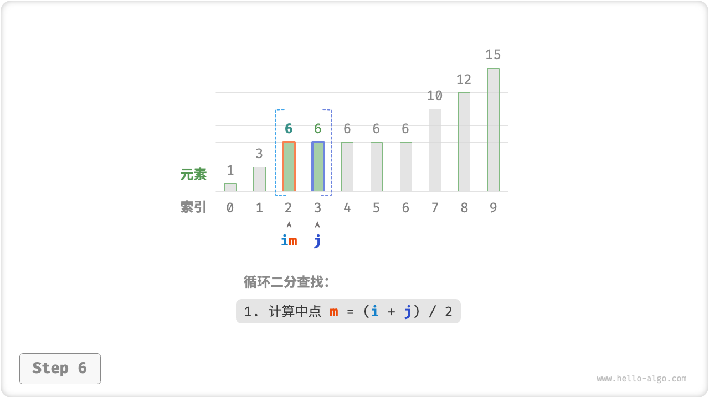
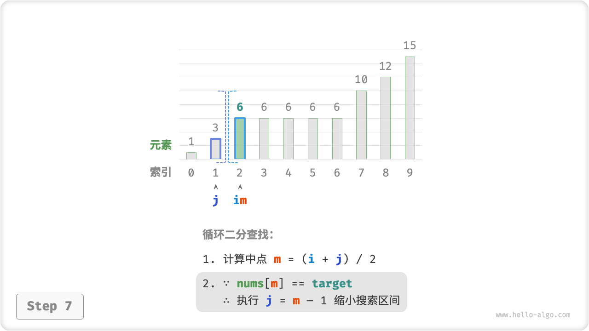
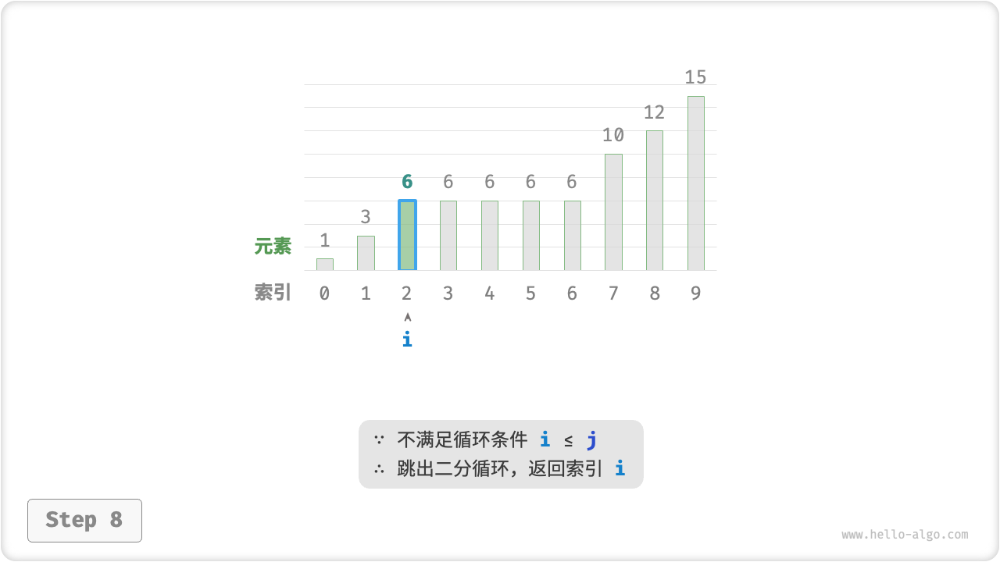

# 二分查找插入点

二分查找不仅可用于搜索目标元素，还具有许多变种问题，比如搜索目标元素的插入位置。

## 无重复元素的情况

!!! question

    给定一个长度为 $n$ 的有序数组 `nums` 和一个元素 `target` ，数组不存在重复元素。现将 `target` 插入到数组 `nums` 中，并保持其有序性。若数组中已存在元素 `target` ，则插入到其左方。请返回插入后 `target` 在数组中的索引。


如果想要复用上节的二分查找代码，则需要回答以下两个问题。

**问题一**：当数组中包含 `target` 时，插入点的索引是否是该元素的索引？

题目要求将 `target` 插入到相等元素的左边，这意味着新插入的 `target` 替换了原来 `target` 的位置。也就是说，**当数组包含 `target` 时，插入点的索引就是该 `target` 的索引**。

**问题二**：当数组中不存在 `target` 时，插入点是哪个元素的索引？

进一步思考二分查找过程：当 `nums[m] < target` 时 $i$ 移动，这意味着指针 $i$ 在向大于等于 `target` 的元素靠近。同理，指针 $j$ 始终在向小于等于 `target` 的元素靠近。

因此二分结束时一定有：$i$ 指向首个大于 `target` 的元素，$j$ 指向首个小于 `target` 的元素。**易得当数组不包含 `target` 时，插入索引为 $i$** 。

=== "Python"

    ```python title="binary_search_insertion.py"
    [class]{}-[func]{binary_search_insertion_simple}
    ```

=== "C++"

    ```cpp title="binary_search_insertion.cpp"
    [class]{}-[func]{binarySearchInsertionSimple}
    ```

=== "Java"

    ```java title="binary_search_insertion.java"
    [class]{binary_search_insertion}-[func]{binarySearchInsertionSimple}
    ```

=== "C#"

    ```csharp title="binary_search_insertion.cs"
    [class]{binary_search_insertion}-[func]{binarySearchInsertionSimple}
    ```

=== "Go"

    ```go title="binary_search_insertion.go"
    [class]{}-[func]{binarySearchInsertionSimple}
    ```

=== "Swift"

    ```swift title="binary_search_insertion.swift"
    [class]{}-[func]{binarySearchInsertionSimple}
    ```

=== "JS"

    ```javascript title="binary_search_insertion.js"
    [class]{}-[func]{binarySearchInsertionSimple}
    ```

=== "TS"

    ```typescript title="binary_search_insertion.ts"
    [class]{}-[func]{binarySearchInsertionSimple}
    ```

=== "Dart"

    ```dart title="binary_search_insertion.dart"
    [class]{}-[func]{binarySearchInsertionSimple}
    ```

=== "Rust"

    ```rust title="binary_search_insertion.rs"
    [class]{}-[func]{binary_search_insertion}
    ```

=== "C"

    ```c title="binary_search_insertion.c"
    [class]{}-[func]{binarySearchInsertionSimple}
    ```

=== "Zig"

    ```zig title="binary_search_insertion.zig"
    [class]{}-[func]{binarySearchInsertionSimple}
    ```

## 存在重复元素的情况

!!! question

    在上一题的基础上，规定数组可能包含重复元素，其余不变。

假设数组中存在多个 `target` ，则普通二分查找只能返回其中一个 `target` 的索引，**而无法确定该元素的左边和右边还有多少 `target`**。

题目要求将目标元素插入到最左边，**所以我们需要查找数组中最左一个 `target` 的索引**。初步考虑通过下图所示的步骤实现。

1. 执行二分查找，得到任意一个 `target` 的索引，记为 $k$ 。
2. 从索引 $k$ 开始，向左进行线性遍历，当找到最左边的 `target` 时返回。


此方法虽然可用，但其包含线性查找，因此时间复杂度为 $O(n)$ 。当数组中存在很多重复的 `target` 时，该方法效率很低。

现考虑拓展二分查找代码。如下图所示，整体流程保持不变，每轮先计算中点索引 $m$ ，再判断 `target` 和 `nums[m]` 大小关系，分为以下几种情况。

- 当 `nums[m] < target` 或 `nums[m] > target` 时，说明还没有找到 `target` ，因此采用普通二分查找的缩小区间操作，**从而使指针 $i$ 和 $j$ 向 `target` 靠近**。
- 当 `nums[m] == target` 时，说明小于 `target` 的元素在区间 $[i, m - 1]$ 中，因此采用 $j = m - 1$ 来缩小区间，**从而使指针 $j$ 向小于 `target` 的元素靠近**。

循环完成后，$i$ 指向最左边的 `target` ，$j$ 指向首个小于 `target` 的元素，**因此索引 $i$ 就是插入点**。

=== "<1>"
    

=== "<2>"
    

=== "<3>"
    

=== "<4>"
    

=== "<5>"
    

=== "<6>"
    

=== "<7>"
    

=== "<8>"
    

观察以下代码，判断分支 `nums[m] > target` 和 `nums[m] == target` 的操作相同，因此两者可以合并。

即便如此，我们仍然可以将判断条件保持展开，因为其逻辑更加清晰、可读性更好。

=== "Python"

    ```python title="binary_search_insertion.py"
    [class]{}-[func]{binary_search_insertion}
    ```

=== "C++"

    ```cpp title="binary_search_insertion.cpp"
    [class]{}-[func]{binarySearchInsertion}
    ```

=== "Java"

    ```java title="binary_search_insertion.java"
    [class]{binary_search_insertion}-[func]{binarySearchInsertion}
    ```

=== "C#"

    ```csharp title="binary_search_insertion.cs"
    [class]{binary_search_insertion}-[func]{binarySearchInsertion}
    ```

=== "Go"

    ```go title="binary_search_insertion.go"
    [class]{}-[func]{binarySearchInsertion}
    ```

=== "Swift"

    ```swift title="binary_search_insertion.swift"
    [class]{}-[func]{binarySearchInsertion}
    ```

=== "JS"

    ```javascript title="binary_search_insertion.js"
    [class]{}-[func]{binarySearchInsertion}
    ```

=== "TS"

    ```typescript title="binary_search_insertion.ts"
    [class]{}-[func]{binarySearchInsertion}
    ```

=== "Dart"

    ```dart title="binary_search_insertion.dart"
    [class]{}-[func]{binarySearchInsertion}
    ```

=== "Rust"

    ```rust title="binary_search_insertion.rs"
    [class]{}-[func]{binary_search_insertion}
    ```

=== "C"

    ```c title="binary_search_insertion.c"
    [class]{}-[func]{binarySearchInsertion}
    ```

=== "Zig"

    ```zig title="binary_search_insertion.zig"
    [class]{}-[func]{binarySearchInsertion}
    ```

!!! tip

    本节的代码都是“双闭区间”写法。有兴趣的读者可以自行实现“左闭右开”写法。

总的来看，二分查找无非就是给指针 $i$ 和 $j$ 分别设定搜索目标，目标可能是一个具体的元素（例如 `target` ），也可能是一个元素范围（例如小于 `target` 的元素）。

在不断的循环二分中，指针 $i$ 和 $j$ 都逐渐逼近预先设定的目标。最终，它们或是成功找到答案，或是越过边界后停止。
